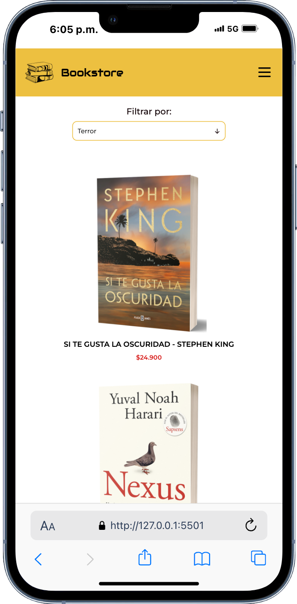
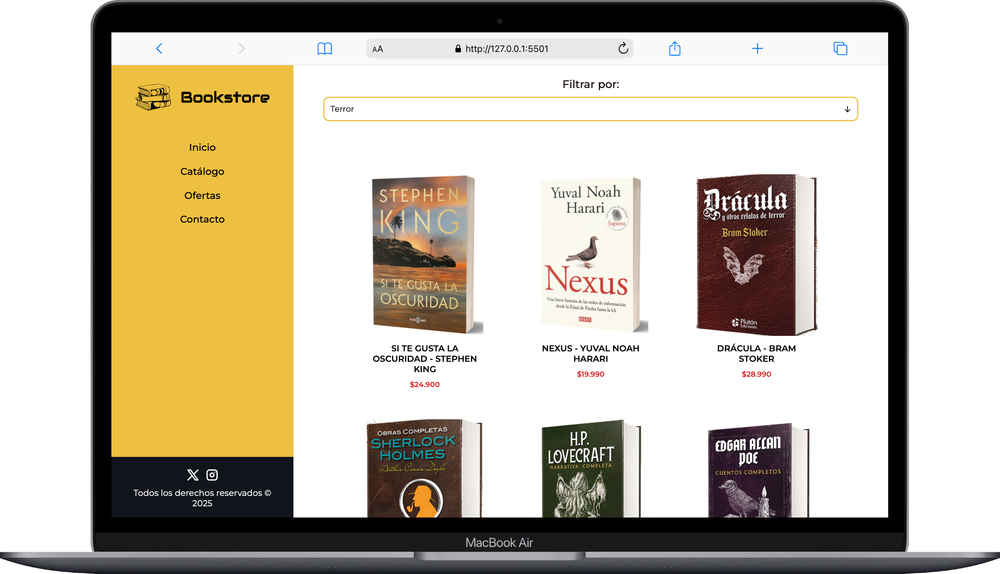

## 📚 Bookstore

### 🎯 Desafió 3 - Media Queries (Módulo CSS Avanzado) 

> [!NOTE]
> Proyecto realizado validando conocimientos de media queries y breakpoints aplicados al diseño de layouts responsivos. 

<!-- > [!TIP]
> Para visualizar el proyecto en tu navegador puedes utilizar el siguiente enlace: [Ver proyecto](https://isra-osvaldo.github.io/messaging-system/) -->

    
    
    

